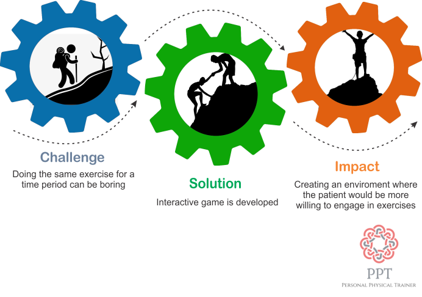
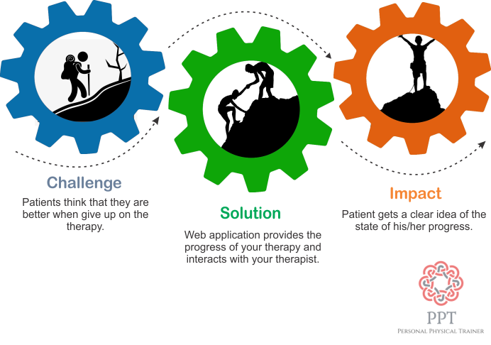
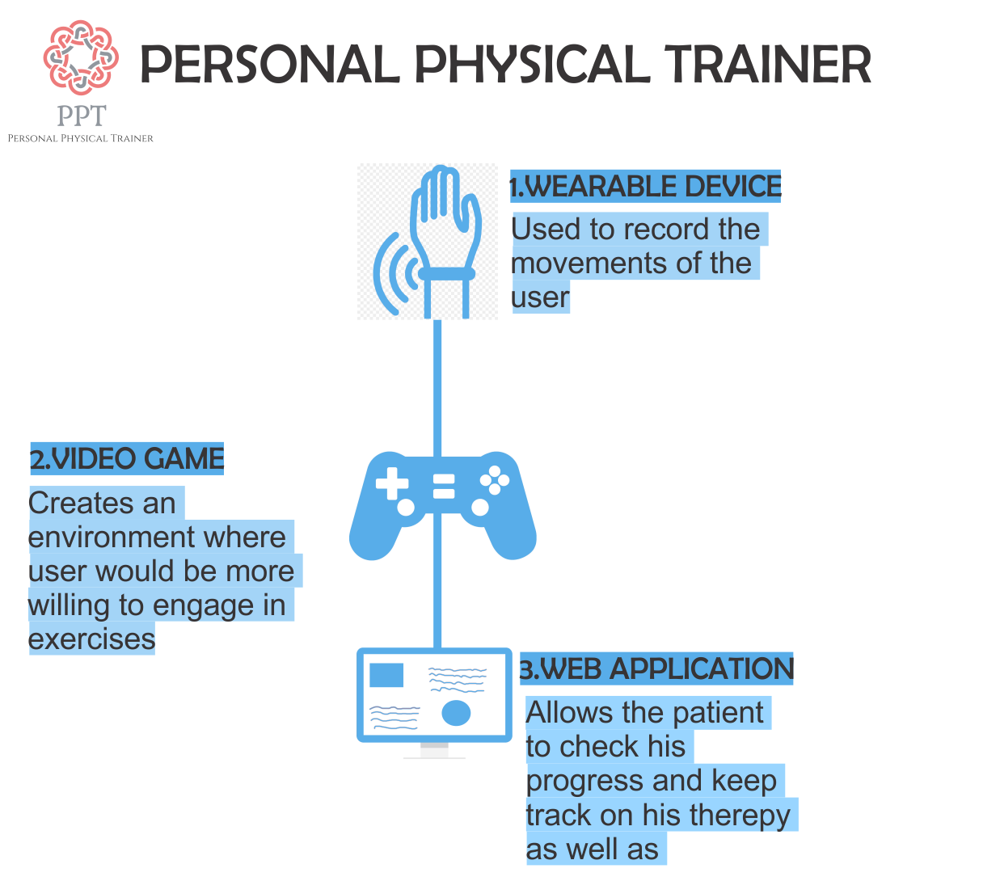
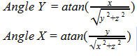

[comment]: # "This is the standard layout for the project, but you can clean this and use your own template"

# Personal Physical Trainer (PPT)

---

## Team
-  E/15/059, DASSANAYAKE P.S.B., [prageethda@gmail.com](mailto:prageethda@gmail.com)
-  E/15/023, ATHAPATTU A.D., [avishka0303@gmail.com](mailto:avishka0303@gmail.com)
-  E/15/238, NANAYAKKARA G.S.C., [sewwandiecn@gmail.com](mailto:sewwandiecn@gmail.com)

## Table of Contents
1. [Introduction](#introduction)
2. [Solution Architecture](#solution-architecture )
3. [Hardware & Software Designs](#hardware-and-software-designs)
4. [Links](#links)

---

## Introduction

1.What is physiotherapy?

Physiotherapy is a treatment method for injuries or deformities using physical exercises.

 

2.What is Personal Physical Trainer?

Personal Physical Trainer is an innovation for physiotherapy. It creates an environment where the patients would be more willing to engage in physiotherapy   as well as it makes sure that patient would do the correct movements. This also allows the therapist to monitor the progress of his/hers patient and whether the patient carries out the necessary exercises.

3.Why should people use PPT?

There are millions and millions of people who do physiotherapy but  about 20% of them get cured in the relevant time period if we trace the causes for it we can see that most of the time people give up physiotherapy and they do not do the exercises they supposed to. One of the major draw back in traditional methods of physiotherapy is that therapist would examine the patient at the start of therapy and then again examine the patient after period of time. Within that time period the patient’s progress isn’t not monitored. So they tend not engage on exercises or some do not have a clue whether they are doing the correct movements.

4.How does PPT work?

We build a wearable to read the movements of the patient. A game is develop that would be controlled by the movements of the patients. In order to reach the goe als with in the game the patient has to engage in the correct movements themselves.  We record data that is needed for the therapist such as speed, time period patient engaged in the activity as well as number movement. With all the data therapist can monitor the patient’s development.  

[Intro Video](data/videos/PPT.mp4)

## Solution Architecture  

Physiotherapy is one of the leading medical tactics that uses physical therapy to cure injuries or deformities. However the effectiveness of this method is not up to a satisfactory level yet. The reason cited for the said is that  only 20% out of the millions of people who undergo physiotherapy, gets cured within the expected time period. A close example could be found out from our team itself. One of our team members underwent physiotherapy in order to cure torn tissue; however as soon as he felt better to a certain extent he stopped the treatments and he continues to suffer from on and off knuckle pains to this date. In the prevailing system, therapist only examines the patient at the beginning and after a certain time period. 

 Within this duration the patient is not monitored at all.

Unless the patient is very obedient towards his treatment, the chances of him following this procedure regularly and accurately are very low. Reasons for this could be identified as follows:

- Doing the same exercise can be boring
- With the busy schedules they tend to forget about therapy sessions  
- Sometimes patients think that they are better and give up on the therapy. 
- Some don’t know the right way to do it

This is where PPT comes in it allows its users to follow the correct treatment.

  
  

## Hardware and Software Designs

### High Level Design  

Statistics show that effectiveness of physiotherapy has decreased into the level of 20% cause of the unwilling of patience continue on therapy, lack of knowledge about what exercises patient has to do, lack of constant monitoring of a patient and the lack of patient and therapist interaction our intent is to develop a system where we can reduce these barriers and lift up the effectiveness of physiotherapy. Physiotherapy is one of the leading medical fields in the world and which shows promising results by following the treatments correctly. Following diagram shows how Personal Physio Therepy (PPT) lifts up these issues.  

  

### Background Maths  

#### Euler’s angle  

  
Euler's angle is used to get the most accurate angle from the accelerometer.  
  

#### Complementary Filter  

Complimentary filter is used to get the most accurate angle with the data from the accelerometer and the gyroscope. Data from Gyroscope precise but tend to drift. Data from accelerometer is bit unstable but not drift. So we filter them out to get the best angle.  

  

The Complementary Filter is actually a union of two different filters: a High-pass Filter for the gyroscope and a Low-pass Filter for the Accelerometer. The first lets only pass the values above a certain limit, unlike the Low-pass filter, which only allows those below

 

- Total Anglex = 0.98 × (Total Anglex + Gyrodatay.elapsedTime) + 0.02 × accelerometer angle

- 98% - Gyro data

- 2% - Accelometer data  

## Links

- <a href = "https://github.com/cepdnaclk/e15-3yp-Personal-Physical-Trainer-PPT" target = "_blank"> Project Repository </a>
- <a href = "https://cepdnaclk.github.io/e15-3yp-Personal-Physical-Trainer-PPT/" target = "_blank">Project Page</a>
- <a href = "http://www.ce.pdn.ac.lk/" target = "_blank">Department of Computer Engineering</a>
- <a href = "https://eng.pdn.ac.lk/" target = "_blank">University of Peradeniya</a>

[//]: # (Please refer this to learn more about Markdown syntax)
[//]: # (https://github.com/adam-p/markdown-here/wiki/Markdown-Cheatsheet)
